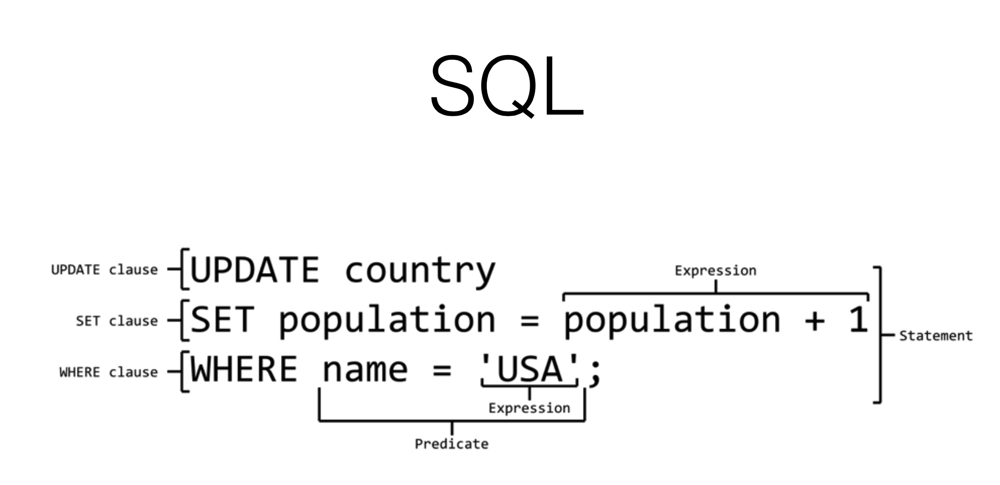

# Active Record
## SQL

## Active Record feature
    Migration Association
    Column Value Typecasting Identity Map
    Schema Dump
    Fixtures
    Prepare Statement
    Connection Pool Query Cache Connection Reaper Session Store
    Timestamp STI DDL Generation Transaction Lock Query Explain
    Statement Cache Validations
    Enum Column
    SQL Sanitization Callbacks

   Arel
   
